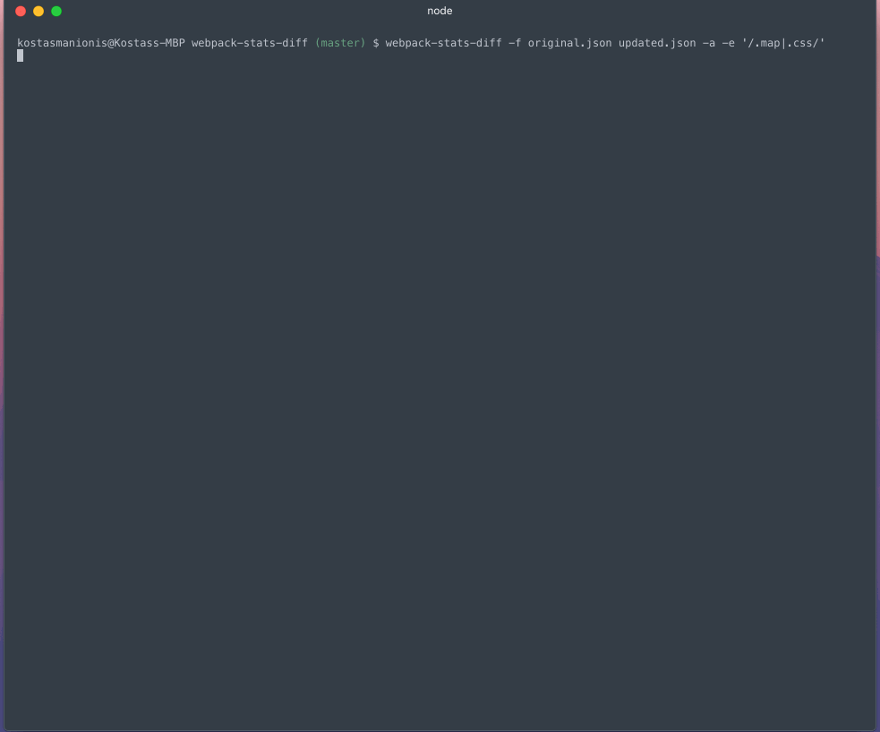

# UNSTABLE, NOT ON NPM... yet
# webpack-stats-diff

A module for diffing two webpack stats files.

## Generating a stats file

`webpack --json > stats.json`

You might need to clean it up if there's additional output. It's a big file, so use something like vim.

## Basic usage

`webpack-stats-diff --chunks --files clean.json loader.json`
